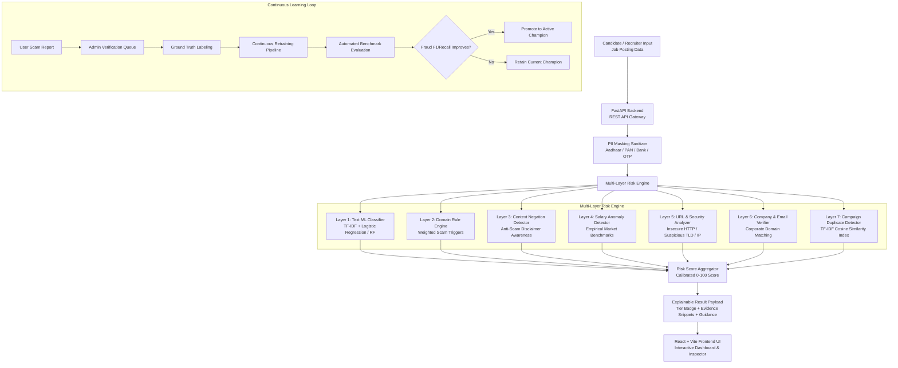

# System Architecture & REST API Documentation

## 1. System Architecture Overview

The **Fake Job Posting & Recruitment Scam Detection Platform** is an enterprise-grade, real-time, explainable AI cybersecurity system designed to identify fraudulent recruitment campaigns, prevent financial losses, and safeguard candidate privacy.



---

## 2. Risk Layer Weights & Aggregation Logic

| Layer | Component | Weight | Key Detection Indicators |
|---|---|---|---|
| **Layer 1** | Text ML Model | **30%** | Sublinear TF-IDF unigram/bigram n-gram features learned from 17,880 postings. |
| **Layer 2** | Domain Rule Engine | **30%** | Upfront registration/training fees, equipment deposits, cashier check/wire overpayment, telegram/whatsapp exclusive interviews, OTP/banking requests. |
| **Layer 3** | Anti-Scam Disclaimer Negation | *Modifier* | Windowed context parser that prevents false positives when employers include anti-scam warnings (*"we never ask for fees"*). |
| **Layer 4** | Company & Email Verifier | **20%** | Brand impersonation (e.g. Microsoft using @gmail.com), lookalike domain mismatch. |
| **Layer 5** | URL & Domain Security | **15%** | Plain HTTP protocol, raw IP address hosts, high-risk TLDs (.xyz, .top, .click), shorteners. |
| **Layer 6** | Salary Anomaly Analyzer | **5%** | Extreme wage inflation for entry-level or low-skill roles ($500/day or $65/hr for typing). |
| **Layer 7** | Campaign Duplicate Detector | *Bonus* | Cosine similarity >0.70 against recurring syndicated fraud templates. |

### Risk Tiers
- **Low Risk (0–30)**: *Likely Genuine* — Normal market compensation, verified corporate domain, clean URL, no scam rule triggers.
- **Medium Risk (31–60)**: *Suspicious (Flag for Review)* — Unverified domain, borderline salary claims, or unindexed employer.
- **High Risk (61–100)**: *Likely Fraudulent* — Direct fee requests, check cashing scheme, brand impersonation, or OTP solicitation.

---

## 3. REST API Endpoint Reference

### 3.1 Job Analysis Endpoints

#### `POST /api/analyze-job`
Performs end-to-end multi-layer fraud analysis on a structured job posting.

**Request Body:**
```json
{
  "title": "Senior Software Engineer",
  "company": "Amazon",
  "description": "Design backend cloud microservices on AWS...",
  "requirements": "5+ years software engineering experience.",
  "salary": "$140,000 - $175,000",
  "contact_email": "recruiting@amazon.com",
  "application_url": "https://amazon.jobs/careers/123",
  "location": "Seattle, WA",
  "experience": "Mid-Senior Level",
  "model_type": "champion"
}
```

**Response (200 OK):**
```json
{
  "job_id": 1,
  "risk_level": "Low",
  "risk_score": 12,
  "verdict": "Likely Genuine",
  "verdict_badge": "Low Risk (Likely Genuine)",
  "recommendation": "This posting appears standard with low risk signals...",
  "risk_factors": [],
  "matched_snippets": [],
  "disclaimer_found": false,
  "breakdown": {
    "ml_probability": 0.05,
    "ml_score": 5,
    "rule_score": 0,
    "company_risk_score": 0,
    "url_risk_score": 0,
    "salary_risk_score": 0,
    "campaign_similarity": 12.4
  },
  "signals": { ... },
  "claims_policy_notice": "Decision-support evaluation only; not an absolute guarantee...",
  "analysis_time_ms": 6.82
}
```

#### `POST /api/analyze-batch`
Uploads and evaluates a batch CSV file (up to 5,000 rows / 15MB).

**Response (200 OK):**
```json
{
  "total_processed": 500,
  "high_risk_count": 28,
  "medium_risk_count": 45,
  "low_risk_count": 427,
  "results": [ ... ],
  "download_id": "9b1deb4d-3b7d-4bad-9bdd-2b0d7b3dcb6d"
}
```

#### `GET /api/download-batch/{download_id}`
Streams the enriched CSV file containing calculated risk scores, risk levels, verdicts, and primary risk reasons.

---

### 3.2 Feedback & Continuous Learning Endpoints

#### `POST /api/report-job`
Submits a candidate fraud report to the admin review queue.

**Request Body:**
```json
{
  "job_id": 12,
  "job_title": "Fake Data Typist",
  "company": "ScamCo",
  "job_description": "Pay $150 registration fee...",
  "report_reason": "asked_for_payment",
  "description": "Recruiter asked me to wire money before the interview.",
  "reporter_email": "candidate@example.com"
}
```

#### `GET /api/reports`
Lists reported job postings. Supports query filter `?status=pending|verified_fraud|verified_genuine|rejected`.

#### `POST /api/admin/verify-report`
Admin verification endpoint to designate verified ground-truth labels.

**Request Body:**
```json
{
  "report_id": 1,
  "decision": "verified_fraud",
  "admin_notes": "Confirmed upfront wire transfer scam."
}
```

#### `POST /api/admin/retrain`
Triggers the continuous learning retraining pipeline incorporating all verified reports. Promotes the new model to active champion only if headline metrics improve.

---

### 3.3 MLOps & Dashboard Telemetry Endpoints

#### `GET /api/model-info`
Returns active production model metadata, feature counts, and training metrics.

#### `GET /api/model-versions/compare`
Returns side-by-side performance comparison across Logistic Regression, Random Forest, and model iterations.

#### `GET /api/dashboard/stats`
Returns total jobs analyzed, risk tier distributions, and recent scanned postings.

#### `GET /api/threat-insights`
Returns top fraud typologies, trigger keyword cloud, and threat point weights.
